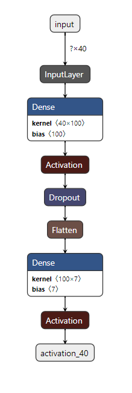

Predicting the age and emotion from speech.

## Dataset: 

https://tspace.library.utoronto.ca/handle/1807/24487

Authors: Kate Dupuis, M. Kathleen Pichora-Fuller

University of Toronto, Psychology Department, 2010.

## Approach

Finding the MFCC of the audio data and using them as the features for training a classification model.

## Models

### Age 

### Emotion

### Joint

